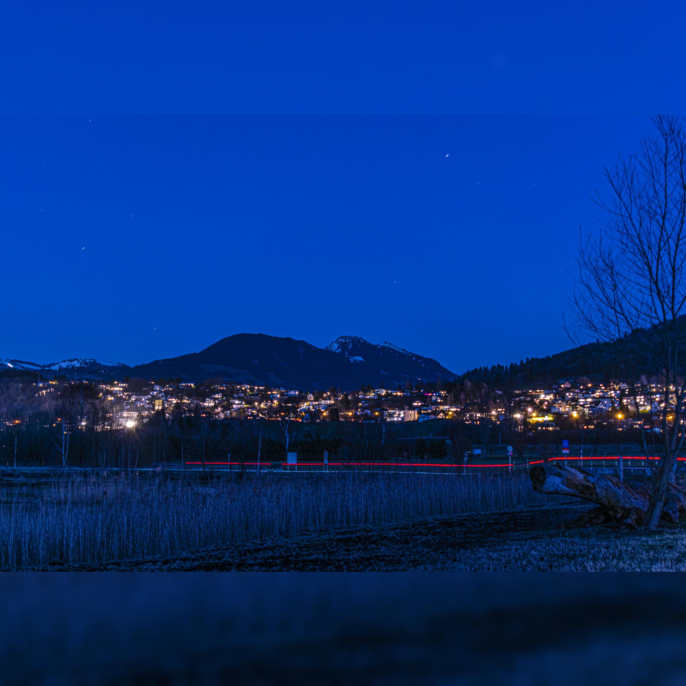
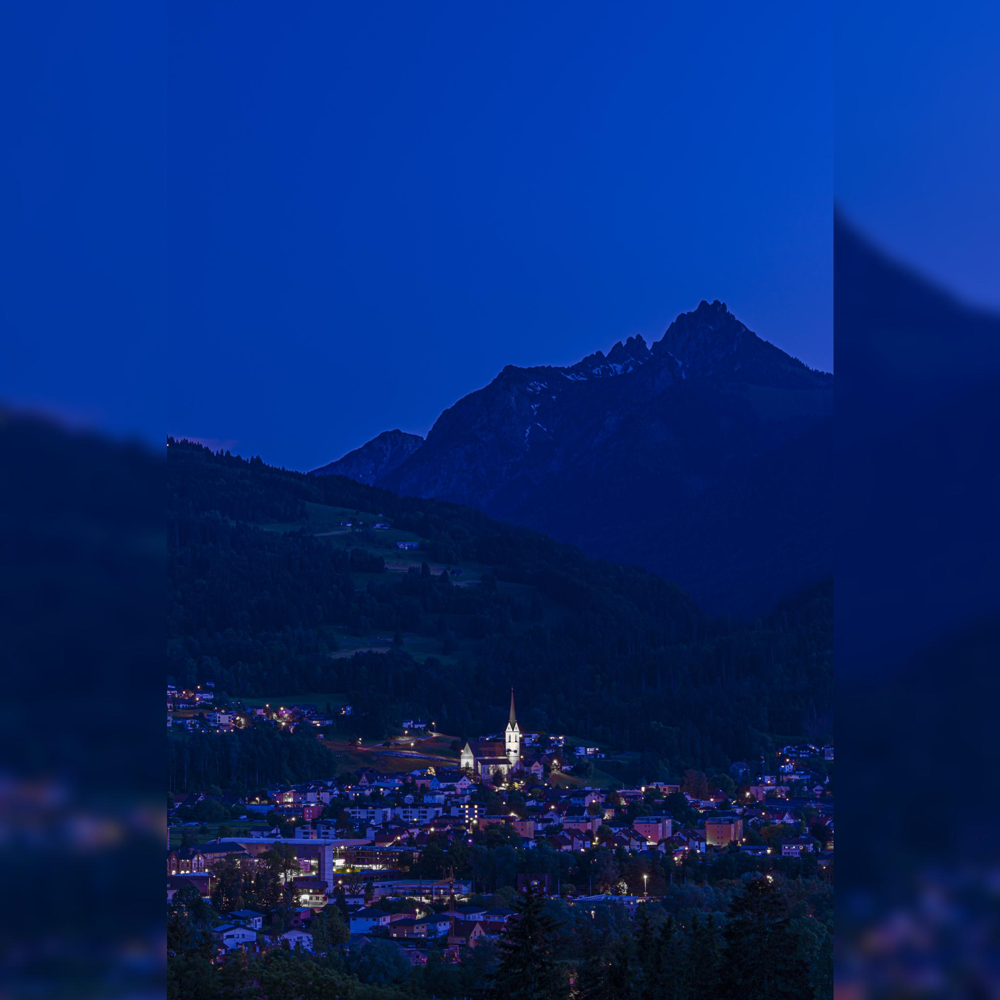

# Instagramizer

This is a Python 3 commandline tool which essentially automates what I was doing by hand before in GIMP. 

It takes two arguments: 

1. (Required) the image file name to 'instagramize' 
2. (Optional) the pixel radius of the gaussian blur applied to the background. The default is 10. 

Ex:

`python3 instagramizer.py mycoolphoto.jpg 15`

This will create an instagramized photo under the same directory with the name `instagramized_mycoolphoto.jpg`.

Visual examples (taken by yours truly :wink:):

- Horizontal photo:

- Vertical photo:

## General Process

1. Scale image to 2048px. What this means: 
    - If the photo is landscape, the horizontal side should go to 2048 as background, and overlayed with the photo with _height_ set to 2048px
    - The opposite is true for portrait photos
2. Via some math, the image is pasted in a centered fashion over the background image, which is just the same image, but covering the 2048 x 2048 square, and blurred for nice effect
3. The image is cropped to the correct 2048 x 2048 square and exported

That's it. Enjoy!